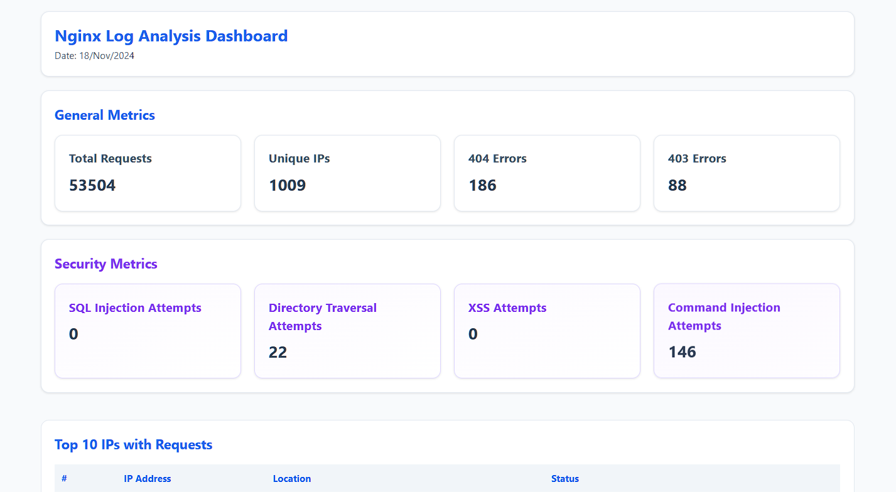

# Nginx Access Log Analyzer and Dashboard Generator



This project is a Bash script designed to analyze Nginx access logs and generate a detailed HTML dashboard with key metrics related to web traffic, security, and performance. The script parses the Nginx access logs to gather insights such as:

- **Request Count:** Total number of requests received.
- **Unique IPs:** List of unique client IPs making requests.
- **Error Counts:** Number of HTTP error responses (e.g., 4xx, 5xx errors).
- **Security Analysis:** Detection of potential security issues, including:
  - SQL Injection attempts
  - Directory Traversal attempts
  - Cross-Site Scripting (XSS) attempts
- **Top IPs and URLs:** Identifies the most frequent IP addresses and URLs accessed, useful for identifying possible sources of traffic spikes or security threats.

Additionally, the script fetches **IP location data** from [**ipinfo.io**](https://ipinfo.io) to provide geographical details for the client IPs. The final output is an interactive HTML dashboard that can be used for both traffic analysis and security monitoring.

### Nginx Standard Log Format

The script analyzes the **Nginx access log** format.

This log line contains the following fields:

1. **IP address**: `192.168.1.1` – The client's IP address.
2. **Timestamp**: `[18/Nov/2024:15:27:36 +0000]` – The time of the request.
3. **Request**: `"GET /index.html HTTP/1.1"` – The HTTP request made.
4. **Status Code**: `200` – The HTTP status code returned.
5. **Response Size**: `3054` – The size of the response body in bytes.
6. **Referrer**: `"https://example.com/"` – The referrer URL.
7. **User Agent**: `"Mozilla/5.0 (Windows NT 10.0; Win64; x64) AppleWebKit/537.36 (KHTML, like Gecko) Chrome/78.0.3904.97 Safari/537.36"` – The user agent string representing the browser making the request.

## Features:
- Parses Nginx access logs.
- Detects common web security vulnerabilities.
- Provides detailed statistics on requests and errors.
- Retrieves IP geolocation data for further analysis.
- Generates a user-friendly HTML dashboard with interactive tables and charts.

## Requirements:
- Bash
- `jq` (for parsing JSON data)
- `curl` (for fetching IP geolocation data)
- Access to Nginx access logs.

## Installation:
Clone the repository and run the script from the command line:

```bash
git clone https://github.com/yourusername/nginx-access-log-analyzer.git
cd nginx-access-log-analyzer
./nginx-today-log.sh
